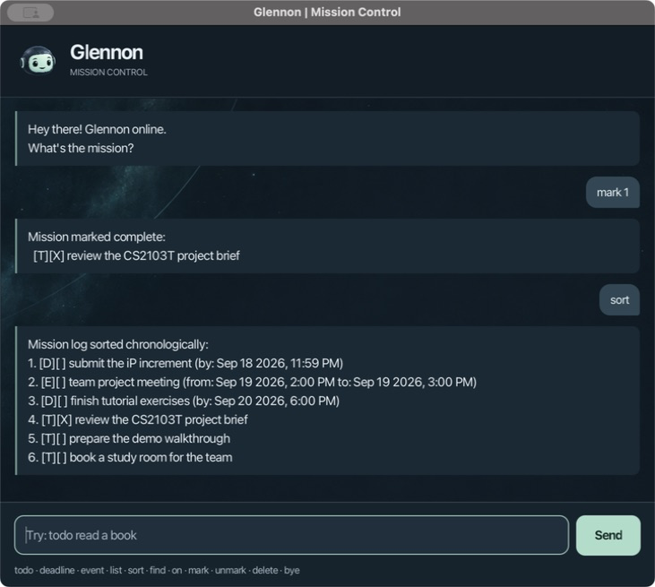

# Glennon User Guide

Glennon helps you keep track of your to-dos, deadlines, and events, one command
at a time. Your tasks are called **missions**, and changes are saved automatically.



[Quick start](#quick-start) · [Commands](#commands-at-a-glance) ·
[Features](#features) · [Saving and troubleshooting](#saving-and-troubleshooting)

## Quick start

This guide describes the current project version. To launch it on macOS:

1. Install **Zulu FX JDK 25.0.3** (`25.0.3.fx-zulu` in SDKMAN) and set
   `JAVA_HOME` to that JDK. Check that `java -version` reports `25.0.3`.
2. [Download the project](https://github.com/ultramanarm/ip/archive/refs/heads/master.zip),
   unzip it, and open a terminal in the extracted project folder. If you already
   have the project, use that folder.
3. Run `./gradlew run` to open Glennon's chat window. The first launch needs an
   internet connection to download build dependencies. If you installed the JDK
   through SDKMAN, you can select it and launch with:

   ```shell
   export JAVA_HOME="$HOME/.sdkman/candidates/java/25.0.3.fx-zulu"
   export PATH="$JAVA_HOME/bin:$PATH"
   ./gradlew run
   ```

4. Type `todo read the project brief`, then press **Enter** or click **Send**.
   Enter `list` to see it, then `mark 1` to complete it if it is your first mission.
5. Enter `bye` to close Glennon. Your missions will be there when you next launch
   it from the same folder.

Prefer a terminal? Run `./gradlew runCli` instead; it accepts the same commands.
For IntelliJ setup or building a standalone `Glennon.jar`, see the
[project setup guide](https://github.com/ultramanarm/ip#readme).

## Commands at a glance

Enter one command at a time, using lowercase command words. Replace text in
`<angle brackets>` with your own values; do not type the brackets. `[HHmm]`
means the time is optional. Dates use **day/month/year**, and times use four
digits on a **24-hour clock**: `17/9/2026 1400` means 17 September 2026 at 2 PM.

| Action | Command |
| --- | --- |
| Add a to-do | `todo <mission>` |
| Add a deadline | `deadline <mission> /by <d/M/yyyy [HHmm]>` |
| Add an event | `event <mission> /from <d/M/yyyy [HHmm]> /to <d/M/yyyy [HHmm]>` |
| Show all missions | `list` |
| Find by description | `find <keyword or phrase>` |
| Show missions on a date | `on <d/M/yyyy>` |
| Sort chronologically | `sort` |
| Mark complete | `mark <number>` |
| Mark incomplete | `unmark <number>` |
| Delete a mission | `delete <number>` |
| Exit | `bye` |

`list`, `sort`, and `bye` take no extra arguments. Mission descriptions can
contain spaces, punctuation, and Unicode text.

## Features

### Add a to-do

Use `todo` for a mission without a date:

```text
todo read the project brief
```

Glennon adds `[T][ ] read the project brief` and shows the new mission count.

### Add a deadline

Use `deadline` with `/by` for a mission due at a particular time:

```text
deadline submit report /by 18/9/2026 1800
```

This is due on 18 September at 6 PM. If you omit the time, as in
`deadline return book /by 19/9/2026`, it defaults to **11:59 PM**.

### Add an event

Use `event` with `/from` followed by `/to`:

```text
event consultation /from 17/9/2026 1400 /to 17/9/2026 1500
```

For an all-day event, leave out both times:

```text
event study break /from 20/9/2026 /to 20/9/2026
```

An omitted start time means the start of that day; an omitted end time means
the end of that day. Events can span multiple days. The end must be after the
start, so identical timed boundaries are rejected, but a same-day all-day
event is valid.

Use each scheduling parameter once. `/by`, `/from`, and `/to` are reserved
words in scheduled commands; ordinary slashes such as `C++/Java` are fine.

### View your mission log

Enter `list` to see all missions, including completed ones. After adding the
first to-do, the report deadline, and the consultation above, you would see:

```text
Mission log:
1. [T][ ] read the project brief
2. [D][ ] submit report (by: Sep 18 2026, 6:00 PM)
3. [E][ ] consultation (from: Sep 17 2026, 2:00 PM to: Sep 17 2026, 3:00 PM)
```

`[T]` is a to-do, `[D]` a deadline, and `[E]` an event. `[ ]` means incomplete;
`[X]` means complete. The number at the start is used to update or delete a
mission.

### Find missions by description or date

`find report` shows descriptions containing `report`, including `submit report`.
Searches are **case-sensitive**: `find Report` will not match `submit report`.
You can also search for a phrase, such as `find project brief`.

`on 17/9/2026` shows deadlines due that day and events spanning that day.
Both an event's start and end dates are included, even when it ends at midnight.
To-dos are excluded because they have no date. Both searches include completed
missions; if nothing matches, Glennon shows a heading with no mission rows.

**Search results keep the numbers from the full log.** For example, if a search
shows only `3. [E][ ] consultation ...`, use `mark 3` to complete it.

### Mark, unmark, or delete a mission

Use the mission's displayed number:

| Example | Result |
| --- | --- |
| `mark 1` | Changes mission 1 to complete: `[X]`. |
| `unmark 1` | Changes mission 1 back to incomplete: `[ ]`. |
| `delete 1` | Removes mission 1 from the log and saved data. |

Numbers start at `1` and must identify an existing mission. There is no undo
command, so check the number before deleting. Deleting or sorting can change
the numbers; run `list` or repeat your search before the next update.

### Sort chronologically

Enter `sort` to order deadlines by their due time and events by their start
time. Unscheduled to-dos go last; missions with equal times keep their previous
relative order. Glennon displays and saves the new order.

New missions are added to the end of the log. Run `sort` again when you want
to reorder them.

### Exit Glennon

Enter `bye`. Glennon shows its sign-off message and closes the window.

## Saving and troubleshooting

Glennon saves every successful change to `data/glennon.txt`, relative to the
folder you launch it from. No save command is needed. Keep using the same
folder, and back up this file if you want to move or restore your missions.
Run only one instance against a data file at a time.

- **A command is rejected:** Read the **ATTENTION NEEDED** message. In the
  window, your input stays selected so you can correct it and send it again.
  Check the command spelling, required values, real calendar dates, and mission
  numbers. Rejected commands leave your missions unchanged.
- **“That mission already exists”:** The type, case-sensitive description, and
  schedule match an existing mission, even if it is complete. Extra whitespace
  at the description's edges does not make it different; internal spacing does.
- **Missions seem to be missing:** Check your launch folder. A missing save
  file starts a new, empty log.
- **Input is disabled at startup:** Glennon could not load its save file.
  Back it up, correct the reported data problem (the message identifies the
  line) or restore a valid backup, then restart. For access errors, check the
  file and folder permissions.
- **Saving fails:** Your previous missions, order, and completion states are
  preserved. Fix the file or folder problem described in the message, then
  retry. Use a regular, writable save file, not a directory or symbolic link.
